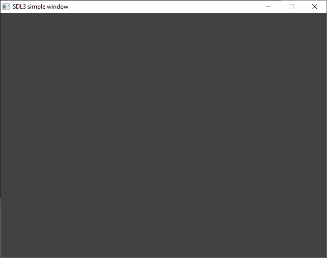

# sdl3-freebasic

FreeBasic bindings for [SDL3](https://github.com/libsdl-org/SDL)

## Status
This project is at an early stage, and feature testing is underway in Windows 10.

## Requirements
You need to have SDL3 (at least version 3.2.16) installed as shared library. That means at runtime, it is trying to load SDL:
- Windows: `SDL3.dll`

## Example
This simple example just opens a window with a gray background:

```FreeBASIC
#include "SDL3/SDL.bi"
 
Sub Main()
    If Not SDL_Init(SDL_INIT_VIDEO) Then
        SDL_Log("Couldn't initialize SDL: %s", SDL_GetError())
        Exit Sub
    End If
  
    Dim As SDL_Window Ptr win
    Dim As SDL_Renderer Ptr renderer
  
    If Not SDL_CreateWindowAndRenderer("SDL3 on FreeBASIC", 640, 480, 0, @win, @renderer) Then
        SDL_Log("Couldn't create window/renderer: %s", SDL_GetError())
        SDL_Quit()
        Exit Sub
    End If

    Dim As SDL_Event e
    Dim As Boolean quit
    
    SDL_SetRenderDrawColor(renderer, 66, 66, 66, 255)

    While Not quit
        While SDL_PollEvent(@e)
            If e.type = SDL_EVENT_QUIT Then
                quit = true
            End If
        Wend
        
        SDL_RenderClear(renderer)
        
        SDL_RenderPresent(renderer)
    Wend
          
    SDL_DestroyRenderer(renderer)
    SDL_DestroyWindow(win)
    SDL_Quit()
End Sub

Main()
```


